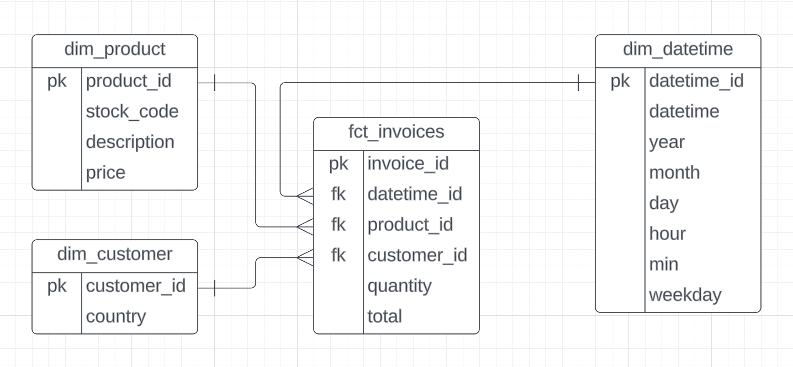

# Data Pipeline : CSV vers BigQuery

## Description

Ce projet met en place un pipeline de données permettant de récupérer des données de ventes à partir d'un fichier CSV et de les intégrer dans Google BigQuery. Les données sont ensuite transformées à l'aide de DBT et contrôlées en termes de qualité grâce à Soda.

Les étapes du projet comprennent :

1. **Récupération et chargement des données** depuis un fichier CSV vers BigQuery avec **Airflow** (via Astro).
2. **Transformation des données** dans BigQuery à l'aide de **DBT** pour générer quatre tables distinctes.
3. **Contrôle de la qualité des données** avec **Soda** pour garantir leur précision et intégrité.

## Technologies utilisées

- **Apache Airflow (Astro)** : Orchestration du pipeline de données.
- **DBT (Cosmos)** : Transformation des données dans BigQuery.
- **Soda** : Vérification de la qualité des données.
- **Google BigQuery** : Stockage des données transformées.

## Structure des données

Les données dans le CSV contiennent les colonnes suivantes :

- **InvoiceNo** : Numéro de la facture.
- **StockCode** : Code produit.
- **Description** : Description du produit.
- **Quantity** : Quantité achetée.
- **InvoiceDate** : Date de la facture.
- **UnitPrice** : Prix unitaire.
- **CustomerID** : ID client.
- **Country** : Pays d'achat.

## Modèle de données

Le processus de transformation via DBT crée quatre tables distinctes dans BigQuery :

